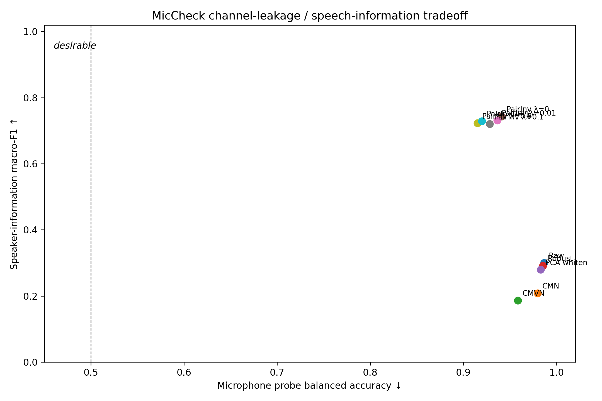
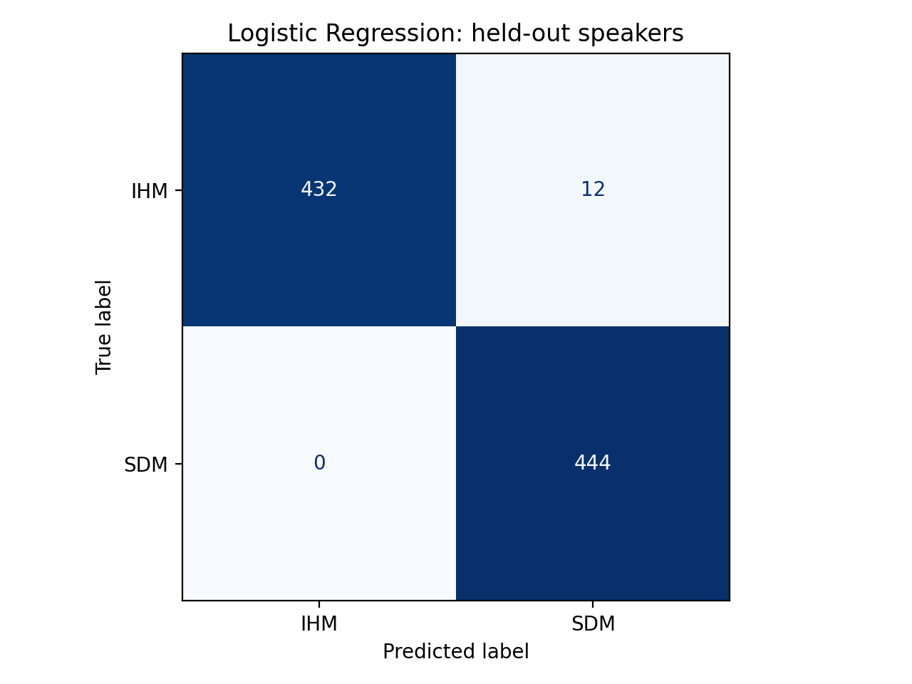
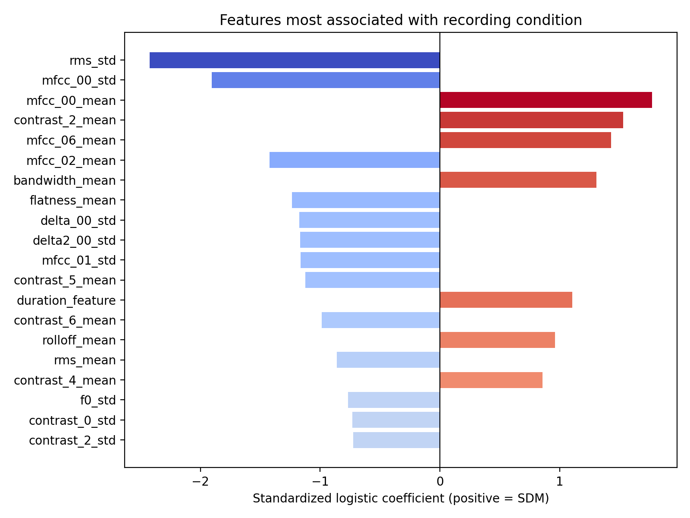
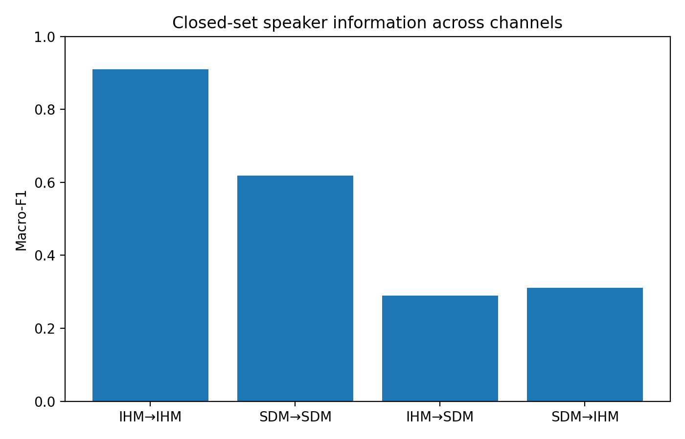
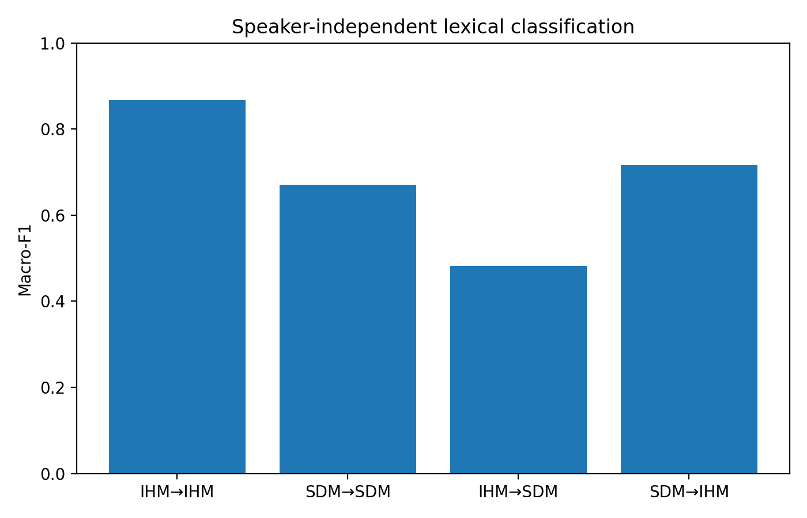
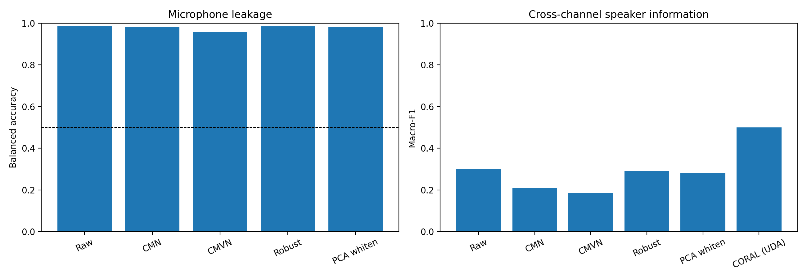
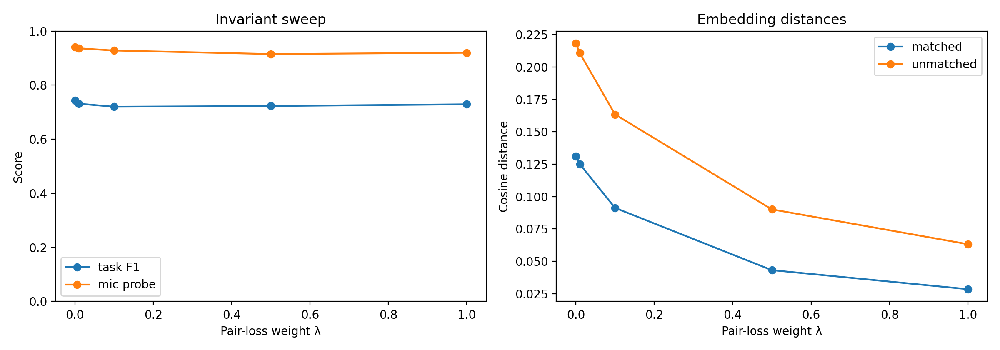
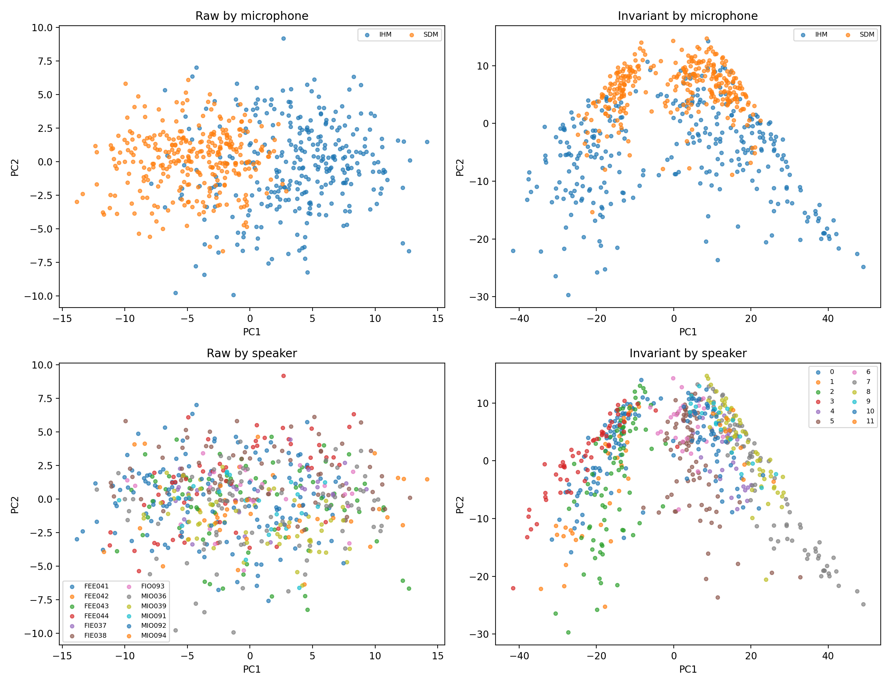
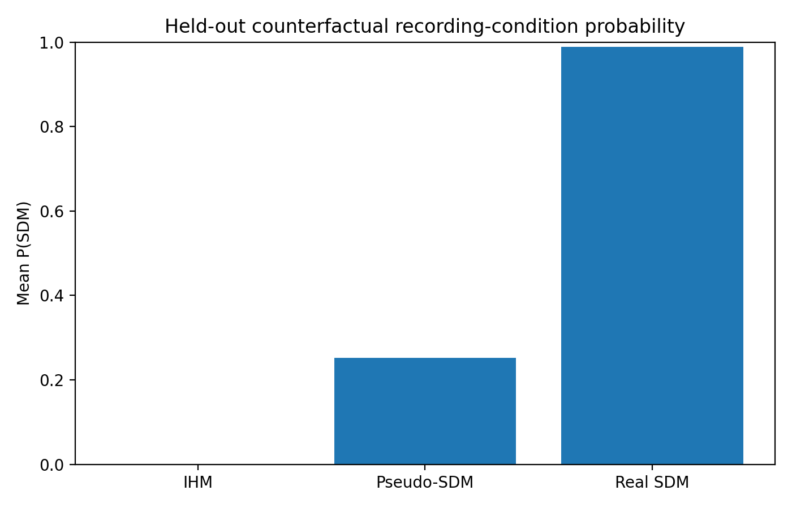
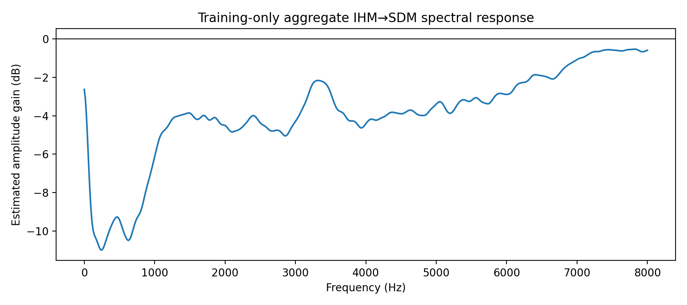

# MicCheck

**Measuring microphone-channel leakage in speech representations**

MicCheck is a reproducible, notebook-first study of how strongly acoustic
features encode the recording channel, how that leakage affects downstream
speech tasks, and whether normalization or invariant learning can reduce it.
The experiment uses time-aligned headset and distant-microphone recordings
from the AMI Meeting Corpus.



## Main findings

| Experiment | Result | Interpretation |
|---|---:|---|
| Raw microphone probe | **98.65% balanced accuracy** | The selected acoustic features almost perfectly identify headset versus distant microphone audio. |
| Speaker ID, same channel | **0.764 macro-F1** | Speaker identity is reasonably recoverable when train and test channels match. |
| Speaker ID, cross channel | **0.300 macro-F1** | Performance collapses under a microphone change. |
| Lexical classification, same channel | **0.769 macro-F1** | Three-word classification works well in-channel. |
| Lexical classification, cross channel | **0.599 macro-F1** | Channel mismatch also harms lexical information. |
| CMVN microphone probe | **0.958 balanced accuracy** | Standard normalization removes only a small part of channel information and can reduce task utility. |
| CORAL cross-channel speaker ID | **0.500 macro-F1** | Unsupervised covariance alignment improves transfer, but assumes access to unlabeled target-channel features. |
| Pair-invariant model, strongest setting | **0.729 task F1 / 0.920 mic probe** | Paired alignment preserves more task performance but does not eliminate channel leakage. |

These results support a narrow conclusion: in this AMI subset, microphone
identity is highly recoverable from conventional acoustic summaries, and
models trained on one channel generalize poorly to another. They do **not**
establish a universal or causal claim about microphone bias.

## Experimental design

```text
AMI Meeting Corpus
       |
       +-- IHM: individual headset microphone
       +-- SDM: single distant microphone
                   |
          aligned utterance pairs
                   |
          acoustic feature extraction
          (MFCC, deltas, pitch, energy,
           spectral and voice-quality summaries)
                   |
       +-----------+--------------------+
       |           |                    |
 microphone     downstream          mitigation
   probe        task transfer      CMVN / CORAL /
                across channels    paired invariance
```

The notebook streams AMI through Hugging Face rather than committing or
downloading the complete corpus. The reported standard run contains 2,000
paired utterances from 14 speakers across 5 meetings. Splits are made by
speaker before modeling to avoid speaker leakage between train and test.

## Results

### 1. Channel identity dominates the feature space

The microphone probe reaches 98.65% balanced accuracy, and feature
coefficients show which acoustic dimensions carry the strongest channel
signal.

| Confusion matrix | Most channel-predictive features |
|---|---|
|  |  |

### 2. Channel mismatch harms downstream generalization

Models evaluated on the same microphone used for training perform much better
than models evaluated on the paired recording from the other microphone.

| Speaker identification | Lexical classification |
|---|---|
|  |  |

### 3. Mitigation creates a utility–invariance trade-off

CMVN and CORAL alter the representation statistically; the paired-invariant
encoder explicitly pulls the two recordings of the same utterance together.
No tested method makes the representation fully channel-invariant without a
cost or an additional assumption.

| Normalization and adaptation | Paired-invariance sweep |
|---|---|
|  |  |



### 4. Counterfactual examples are exploratory

An estimated channel response is applied to a very small set of utterances to
visualize how predictions can move when only the recording channel is
perturbed. With only three examples, this section is a demonstration rather
than quantitative evidence.

| Probability shift | Estimated response |
|---|---|
|  |  |

## Reproduce the study

Python 3.11 or 3.12 is recommended. From a terminal:

```bash
git clone https://github.com/YOUR_USERNAME/miccheck.git
cd miccheck
python3 -m venv .venv
source .venv/bin/activate
python -m pip install --upgrade pip
python -m pip install -r requirements.txt
jupyter lab MicCheck_AMI.ipynb
```

On Windows PowerShell, activate the environment with:

```powershell
.venv\Scripts\Activate.ps1
```

Run the notebook from top to bottom. Its configuration cell exposes three
workload presets:

- `smoke`: a quick pipeline check with a small sample.
- `standard`: the configuration used for the committed results.
- `extended`: a larger, slower experiment for stronger estimates.

The notebook writes generated artifacts under `results/` and creates a
`MicCheck_results.zip` archive. Both are ignored by Git. Curated aggregate
tables and publication-relevant figures are retained in `MicCheck_results/`.

## Repository layout

```text
miccheck/
├── MicCheck_AMI.ipynb        # complete portable experiment
├── MicCheck_results/
│   ├── *.csv                 # aggregate metrics and intervals
│   └── figures/              # figures used in this README
├── requirements.txt          # runtime dependencies
├── LICENSE                   # software license
└── README.md
```

AMI audio, transcripts, per-utterance manifests, extracted features, local
environments, and caches are intentionally excluded. Obtain and use AMI in
accordance with its own terms; the MIT license in this repository applies only
to the MicCheck code and documentation.

## Important limitations

- The standard run is small: 14 speakers and 5 meetings, with only 3 speakers
  and 2 meetings represented in the test partition.
- Meetings can appear in more than one partition even though speakers cannot.
  A leave-one-meeting-out evaluation would test a stronger form of transfer.
- Speaker identification is a closed-set probe, not a speaker-verification
  benchmark.
- The lexical experiment covers only `yeah`, `okay`, and `um`; its test set
  contains 40 paired examples.
- Confidence intervals use item-level bootstrap resampling, not a hierarchical
  speaker- or meeting-level bootstrap.
- CORAL is unsupervised domain adaptation and therefore uses unlabeled target-
  channel features. It is not a source-only normalization method.
- Points in the central trade-off plot come from related but not identical
  protocols: normalization methods use cross-channel probes, while the
  pair-invariant encoder is trained jointly for its downstream objective.
- The counterfactual section contains only three examples.

## Responsible interpretation

Channel leakage means that a model can recover recording-device information
from its input representation. It does not by itself prove demographic bias,
unfair treatment, or causality. Report the corpus, microphone configuration,
split policy, sample counts, uncertainty, and adaptation assumptions whenever
using these results.

## License

MicCheck code and documentation are released under the [MIT License](LICENSE).
The AMI Meeting Corpus is not redistributed by this repository and remains
subject to its original license and usage terms.
