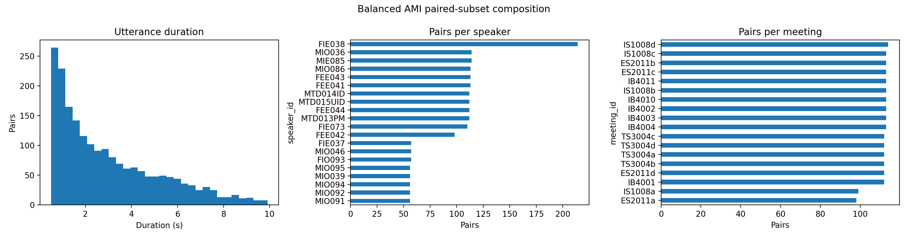
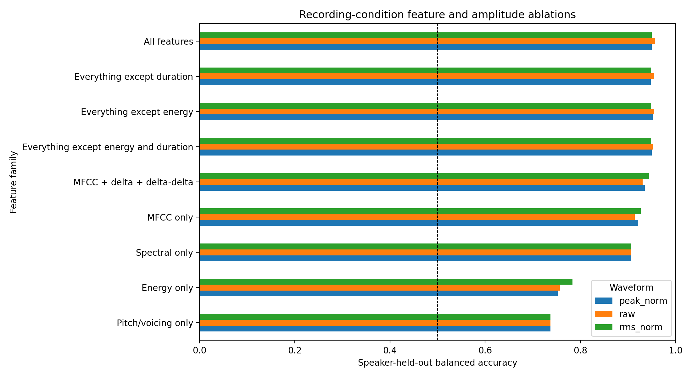
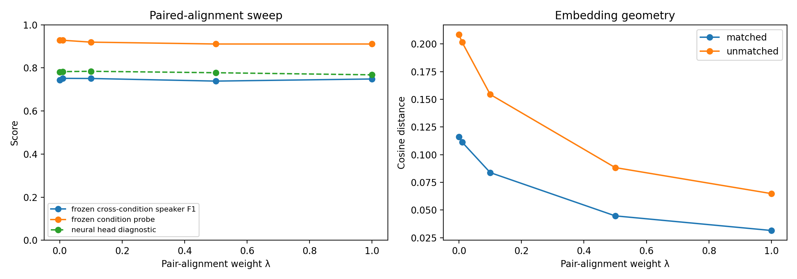
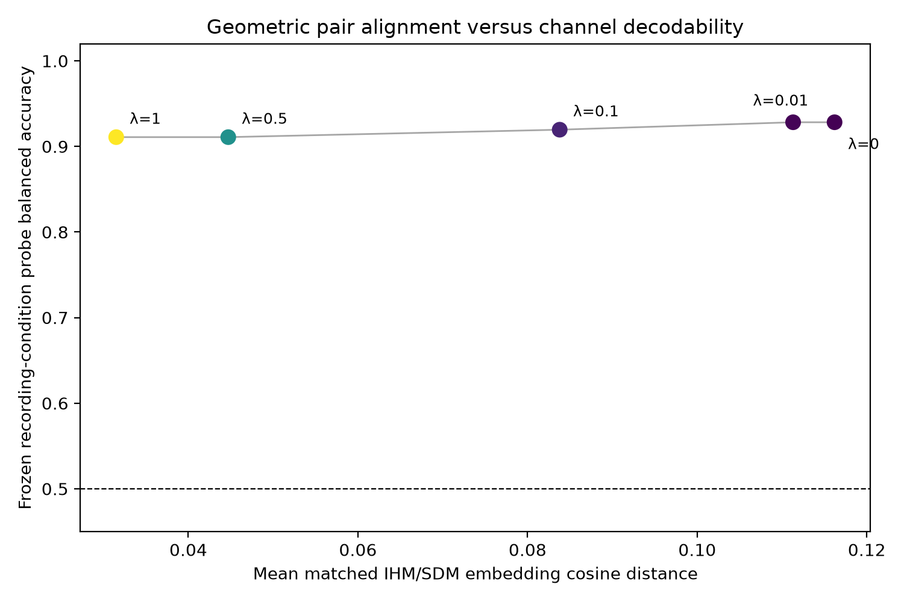

# MicCheck

**Measuring recording-condition information in lightweight speech representations**

MicCheck uses paired close-talk and distant-microphone recordings of the same
AMI speech events to measure recording-condition information, test
cross-condition transfer, identify the acoustic feature families carrying the
signal, and ask whether geometric pair alignment actually removes recoverable
condition information.

> **Main conclusion:** geometric pair alignment is not necessarily
> representational invariance.


## Headline results

The committed results are from the completed **protocol-v2 standard run**.

| Finding | Protocol-v2 result | Interpretation |
|---|---:|---|
| Discovered / sampled pairs | **10,595 / 2,000** | Balanced sampling increased coverage to 21 speakers and 18 meetings. |
| Primary recording-condition probe | **95.46% balanced accuracy** | The validation-selected linear SVM strongly recovered IHM versus SDM for held-out speakers. |
| Five-fold speaker-held-out probe | **95.52% mean balanced accuracy** | Recoverability was consistent across held-out speaker groups. |
| Five-fold meeting-held-out probe | **94.92% mean balanced accuracy** | High accuracy persisted when entire meetings were held out. |
| Raw closed-set speaker probe | **0.802 same / 0.329 cross macro-F1** | Known-speaker information transferred poorly between recording conditions. |
| No energy or duration features | **95.16% balanced accuracy** | Simple level and duration cues did not explain most condition recoverability. |
| Peak- or RMS-normalized waveform | **94.96% balanced accuracy** | Removing gross amplitude differences only modestly changed recoverability. |
| CORAL (UDA) speaker transfer | **0.482 cross-condition macro-F1** | Target-aware covariance alignment improved on Raw's 0.329, under a stronger data-access assumption. |
| PairAlign λ=1 versus λ=0 | **72.89% distance reduction; 1.74-point probe reduction** | Matched embeddings became much closer while recording condition remained highly decodable. |

For the validation-selected primary model, the speaker-cluster bootstrap 95%
interval was **93.70–98.95%**, and the meeting-cluster interval was
**92.77–97.41%**. These intervals remain conditional on the sampled AMI split.

## Scientific scope

IHM and SDM differ in more than microphone hardware: distance, room response,
reverberation, noise, placement, and gain behavior all change. MicCheck
therefore studies the **close-talk versus distant-microphone recording
condition**. It does not isolate a microphone-only causal effect.

The study separates four questions:

- **Condition recoverability:** can a probe identify IHM versus SDM?
- **Cross-condition robustness:** how much does downstream performance change?
- **Geometric pair alignment:** how close do matched embeddings become?
- **Representational leakage:** can a frozen probe still recover condition?

## Protocol

```text
AMI paired speech events
        |
        +-- IHM: close-talk headset condition
        +-- SDM: distant-microphone condition
                         |
              complete metadata pairing
                         |
       deterministic meeting–speaker sampling
                         |
             acoustic representations
        +----------------+----------------+
        |                |                |
 condition probes    transfer probes   mitigation
 speaker-held-out    closed-set        source-only preprocessing
 meeting-held-out    speaker info      CORAL target-aware UDA
 feature ablations   small lexical     paired alignment
        |                |                |
        +----------------+----------------+
                         |
             standardized frozen probes
```

Both channels from every pair remain in the same partition. Scalers, PCA,
encoders, condition responses, and probes are fit on training data only.
Lambda selection uses validation data only. CORAL uses only explicitly
permitted unlabeled target-condition training data.

## Results

### 1. Recording condition remains highly recoverable

The validation-selected linear SVM correctly classified 947 of 992 held-out
recordings. Meeting-held-out performance was similar on average, arguing
against the result being solely a particular-session shortcut.

| Held-out-speaker confusion matrix | Balanced subset audit |
|---|---|
|  |  |

### 2. Amplitude, energy, and duration do not dominate the result

Condition information remained strong after peak or RMS normalization and
after removing energy and duration features. Cepstral and spectral feature
families were independently predictive, although no single ablation isolates
a causal acoustic mechanism.



### 3. Useful information transfers poorly across conditions

The speaker task is explicitly a **closed-set speaker-information probe**:
speaker identities are shared while utterance pairs are disjoint. The lexical
task is a small probe rather than a general speech-recognition benchmark.

| Closed-set speaker information | Small lexical probe |
|---|---|
|  |  |

The lexical directions are asymmetric in this run. That may reflect different
learning difficulty between close-talk and distant speech, but the experiment
does not isolate the cause.

### 4. Source-only preprocessing is not target-aware adaptation

MFCC-CMN and MFCC-CMVN normalize only the cepstral portion of the combined
representation; non-cepstral features remain unchanged. In the source-only
logistic-probe comparison, MFCC-CMVN reduced condition-probe accuracy from
95.67% to 93.75%, but also reduced the closed-set cross-condition speaker
score from 0.329 to 0.256.

CORAL is reported separately because it sees unlabeled target-condition
training features. Its 0.482 cross-condition speaker macro-F1 asks a different
question: how much can target-aware covariance alignment recover?


### 5. Pair alignment does not imply invariance

Validation selected λ=0.1. Relative to λ=0, it reduced matched-pair distance by
27.89%, improved frozen cross-condition speaker macro-F1 by 0.0067, and reduced
condition-probe accuracy by only 0.87 percentage points.

At λ=1, matched-pair distance fell from 0.116 to 0.031—a 72.89% reduction—but
condition-probe accuracy remained 91.09%. The geometric objective succeeded at
alignment without removing most linearly recoverable condition information.

| Alignment sweep | Distance versus condition decodability |
|---|---|
|  |  |

All points in the headline trade-off figure use the same frozen logistic-probe
evaluation. However, representation-training assumptions still differ: the
pair-aligned encoder uses a supervised speaker head and both recording
conditions, while classical representations are fixed feature transforms.
The improvement from Raw to PairAlign λ=0 therefore cannot be attributed to
the alignment penalty. This central comparison uses the closed-set speaker
probe's pair subset, so its condition-probe values are not the same estimand as
the primary held-out-speaker condition probe reported above.

### 6. Counterfactual filtering is exploratory

For three examples, an aggregate training-only spectral response moved mean
P(SDM) from 0.10% on original IHM audio to 25.25% on pseudo-SDM audio; real SDM
was 98.92%. Three examples are insufficient for quantitative or causal claims.

| Probability shift | Training-only spectral response |
|---|---|
|  |  |

## Run directly in Google Colab

The notebook is self-contained and does not require the repository's
`requirements.txt` file in Colab.

1. Download `MicCheck_AMI.ipynb`.
2. Upload it to [Google Colab](https://colab.research.google.com/).
3. Run all cells from top to bottom.

AMI is streamed through Hugging Face. Metadata is discovered before sampling,
selected audio is processed on demand, and the full corpus is not downloaded.

## Run locally

Python 3.11 or 3.12 is recommended:

```bash
git clone https://github.com/ad-srvn/MicCheck.git
cd MicCheck
python3 -m venv .venv
source .venv/bin/activate
python -m pip install --upgrade pip
python -m pip install -r requirements.txt
jupyter lab MicCheck_AMI.ipynb
```

On Windows PowerShell:

```powershell
.venv\Scripts\Activate.ps1
```

Available workload presets are `smoke`, `standard`, and `extended`.
`MAX_PAIRS` limits expensive audio processing, not metadata discovery.

## Repository layout

```text
MicCheck/
├── MicCheck_AMI.ipynb        # self-contained protocol-v2 experiment
├── MicCheck_results/
│   ├── README.md             # result inventory and selected checks
│   ├── *.csv                 # aggregate protocol-v2 tables
│   └── figures/              # aggregate protocol-v2 figures
├── requirements.txt
├── LICENSE
└── README.md
```

AMI audio, transcripts, paired manifests, extracted features, per-example
plots, environments, and caches are intentionally excluded from Git.

## Limitations

- The run contains 21 speakers and 18 meetings from one AMI split; this is not
  a representative population sample.
- The speaker-information task is closed-set, not speaker verification or
  unseen-speaker identification.
- The lexical task uses a small set of frequent single-word classes.
- Cluster bootstrap intervals have limited resolution when the number of
  speakers or meetings is small.
- The pair-aligned encoder and fixed classical representations have different
  training assumptions even though their frozen probes are standardized.
- The counterfactual diagnostic contains only three examples and cannot
  recreate room geometry, noise, or reverberation.
- Strong recording-condition recoverability does not establish demographic
  unfairness, downstream harm in every task, or causality.

## License

MicCheck code and documentation are released under the [MIT License](LICENSE).
The AMI Meeting Corpus is not redistributed and remains subject to its own
license and usage terms.
